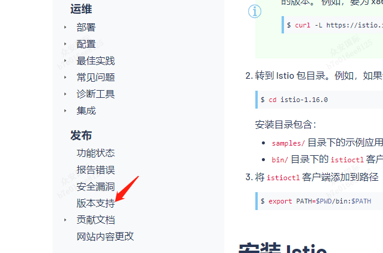
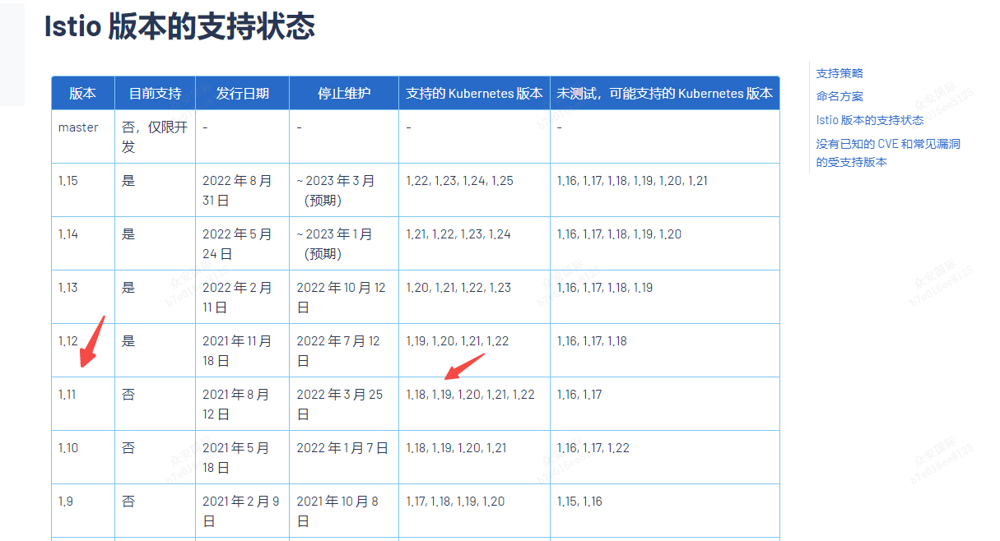
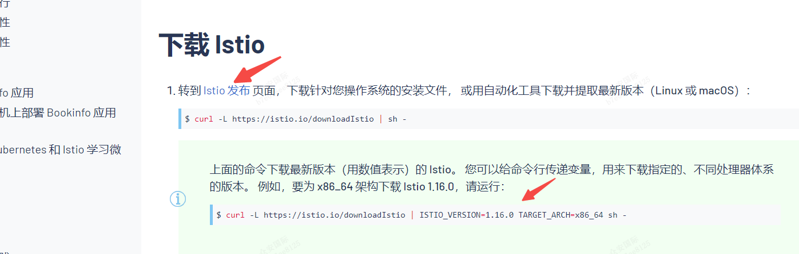
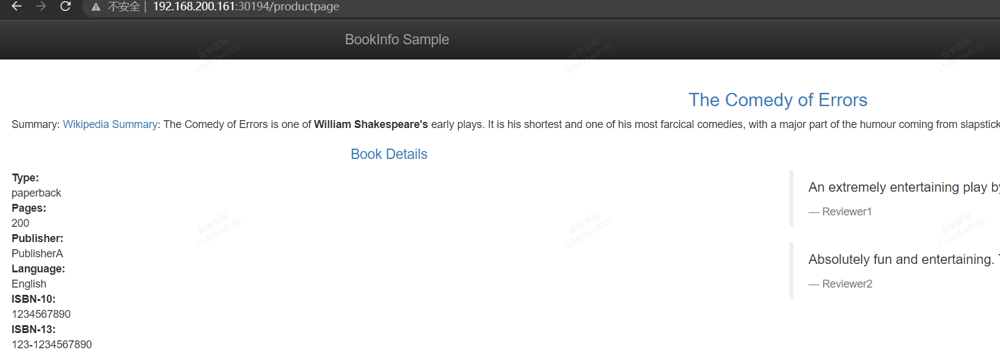

istio的官方中文文档如下，对应最新版本最好参照官网文档：

[https://istio.io/latest/zh/docs](https://istio.io/latest/zh/docs)


本案例是在k8s集群上安装了istio的。

简单理解istio就是通过植入一个envoy的sidecar程序来管理pod的流量，相当于容器的流量代理全部交给envoy进行处理，容器内部的app 程序是不直接对外暴露的

### 1.安装：
#### 1.1 版本选择
首先需要知道你要安装的版本，因此还是需要知道k8s版本，因为版本之间有比较强的关联，
如图，点击版本支持，既可以查询到不同版本对应的选择：


当前我们是1.19版本的k8s，因此我们选择一个1.11版本的istio,（实际选择1.12版本的也行）

上面2步只确定了大版本和小版本，最后还有一个patch版本没确定，可以从这里查询：
如图，点击`istio发布`(这里会进入github的istio release页面):

按照上面选择即可，我这里选择1.11.1

#### 1.2下载
使用如下命令（指定版本1.11.1）：
`curl -L https://istio.io/downloadIstio | ISTIO_VERSION=1.11.1 TARGET_ARCH=x86_64 sh -
`

如果上一步受阻，则可以通过1.1版本选择的最后一步，查到对应的release时，直接点击下载release，选择那个：`istio-1.11.1-linux-amd64.tar.gz`

当然，你需要按照你的系统选择不同的release。下载完毕，保存到指定的操作机上，然后解压：`tar -vzxf istio-1.11.1-linux-amd64.tar.gz`

解压后，进入目录：`cd istio-1.11.1`

将当前的目录下的bin/目录添加到path中，这样，这样istioctl就安装好了：`export PATH=$PWD/bin:$PATH`

使用命令，查询版本，验证安装完毕： 
```
[root@centos01 istio-1.12.3]# istioctl version
client version: 1.12.3
control plane version: 1.12.3
data plane version: 1.12.3 (8 proxies)
```


#### 1.3配置准备
开发阶段，我们直接使用其`demo`模式即可，执行结果。
```shell
$ istioctl install --set profile=demo -y
✔ Istio core installed
✔ Istiod installed
✔ Egress gateways installed
✔ Ingress gateways installed
✔ Installation complete
```
上面这个执行如果中间拉取镜像有问题，首先检查一下镜像仓库的配置，或者手动的拉取镜像，然后推送到本地也可以，
```
#需要的镜像如下：
[root@k8s-node01 ~]# docker images
REPOSITORY                                       TAG        IMAGE ID       CREATED         SIZE
istio/proxyv2                                    1.12.3     17c25ee26bcf   9 months ago    254MB
istio/pilot                                      1.12.3     75081ff825c7   9 months ago    187MB
```

给命名空间添加标签，指示 Istio 在部署应用的时候，自动注入 Envoy 边车代理
```
$ kubectl label namespace default istio-injection=enabled
namespace/default labeled
```

### 2简单使用：
使用我们就使用istio自带的bookinfo的案例，文档就在当前istio的目录下：`samples/bookinfo`

#### 2.1 部署案例：
```
$ kubectl apply -f samples/bookinfo/platform/kube/bookinfo.yaml
service/details created
serviceaccount/bookinfo-details created
deployment.apps/details-v1 created
service/ratings created
serviceaccount/bookinfo-ratings created
deployment.apps/ratings-v1 created
service/reviews created
serviceaccount/bookinfo-reviews created
deployment.apps/reviews-v1 created
deployment.apps/reviews-v2 created
deployment.apps/reviews-v3 created
service/productpage created
serviceaccount/bookinfo-productpage created
deployment.apps/productpage-v1 created
```
在第一次创建的时候，需要拉取很多镜像，可能会导致pod一直起不来，如果起不来，就去查看为何：`kubectl describe po XXX-XXX -n default`
如果是镜像拉取失败，可以选择等一等，或者是检查镜像配置问题，或者是手动拉取镜像：
```
#需要的镜像如下：
[root@k8s-node01 ~]# docker images
REPOSITORY                                       TAG        IMAGE ID       CREATED         SIZE
istio/examples-bookinfo-reviews-v3               1.16.2     83e6a8464b84   2 years ago     694MB
istio/examples-bookinfo-reviews-v2               1.16.2     39cff5d782e1   2 years ago     694MB
istio/examples-bookinfo-reviews-v1               1.16.2     181be23dc1af   2 years ago     694MB
istio/examples-bookinfo-ratings-v1               1.16.2     99ce598b98cf   2 years ago     161MB
istio/examples-bookinfo-details-v1               1.16.2     edf6b9bea3db   2 years ago     149MB
istio/examples-bookinfo-productpage-v1           1.16.2     7f1e097aad6d   2 years ago     207MB
```

#### 2.2 检查资源创建结果
```
$ kubectl get services
NAME          TYPE        CLUSTER-IP      EXTERNAL-IP   PORT(S)    AGE
details       ClusterIP   10.0.0.212      <none>        9080/TCP   29s
kubernetes    ClusterIP   10.0.0.1        <none>        443/TCP    25m
productpage   ClusterIP   10.0.0.57       <none>        9080/TCP   28s
ratings       ClusterIP   10.0.0.33       <none>        9080/TCP   29s
reviews       ClusterIP   10.0.0.28       <none>        9080/TCP   29s

$ kubectl get pods
NAME                              READY   STATUS    RESTARTS   AGE
details-v1-558b8b4b76-2llld       2/2     Running   0          2m41s
productpage-v1-6987489c74-lpkgl   2/2     Running   0          2m40s
ratings-v1-7dc98c7588-vzftc       2/2     Running   0          2m41s
reviews-v1-7f99cc4496-gdxfn       2/2     Running   0          2m41s
reviews-v2-7d79d5bd5d-8zzqd       2/2     Running   0          2m41s
reviews-v3-7dbcdcbc56-m8dph       2/2     Running   0          2m41s
```

#### 2.3最后检查接口
```shell
$ kubectl exec "$(kubectl get pod -l app=ratings -o jsonpath='{.items[0].metadata.name}')" -c ratings -- curl -sS productpage:9080/productpage | grep -o "<title>.*</title>"
<title>Simple Bookstore App</title>
```
实际上上面的执行就是进入到pod内部，然后用curl命令查询一个http的（/productpage）接口是否ok

#### 2.4 打开网关，对外暴露
由于上面那个是pod里面进行curl命令，这样实际是没意义的，一个api我们必须要能对外暴露才行，否则没啥意义。

还记得我们上面说了，这里面的pod的流量会通过一个envoy的sidecar程序管理吗，因此我们打开istio自带的网关，既可以将外部流量流入istio的网关，然后网关将流量流入到指定的pod

实际上这个就是我们熟悉的ingress， 而istio也是通过ingress做的这个事。

那么我们查看一下istio的网关：
```
[root@k8s-node01 ~]# kubectl get svc -n istio-system
NAME                   TYPE           CLUSTER-IP       EXTERNAL-IP   PORT(S)                                                                      AGE
istio-egressgateway    ClusterIP      10.96.192.124    <none>        80/TCP,443/TCP                                                               4d17h
istio-ingressgateway   LoadBalancer   10.97.71.125     <pending>     15021:31814/TCP,80:30194/TCP,443:31805/TCP,31400:31126/TCP,15443:30087/TCP   4d17h
istiod                 ClusterIP      10.104.208.129   <none>        15010/TCP,15012/TCP,443/TCP,15014/TCP                                        4d17h
[root@k8s-node01 ~]# kubectl get no -owide
NAME         STATUS   ROLES    AGE     VERSION    INTERNAL-IP       EXTERNAL-IP   OS-IMAGE                KERNEL-VERSION                CONTAINER-RUNTIME
centos01     Ready    master   4d17h   v1.19.16   192.168.200.160   <none>        CentOS Linux 7 (Core)   3.10.0-1160.80.1.el7.x86_64   docker://20.10.21
k8s-node01   Ready    <none>   4d17h   v1.19.16   192.168.200.161   <none>        CentOS Linux 7 (Core)   3.10.0-1160.80.1.el7.x86_64   docker://20.10.21

```
可以看到，上面`istio-ingressgateway`暴露了80对应30194端口（http用的是80, http用的443），而node ip（我们没有开启master节点接受资源创建）则为：192.168.200.161

因此实际上我们可以知道，通过ingres gateway的流量都是从ip为192.168.200.161， 端口为30194进入的。

这样此时我们在外面的浏览器输入：`http://192.168.200.161:30194/productpage`即可得：


我们还可以通过执行命令的方式查询到上面的ip和port：
```
# 注意，这个host的查询是在自己自建k8s上获取的，如果不是自建的而是购买的集群，则最好去参照文档说明去查询
[root@centos01 istio-1.12.3]# kubectl get po -l istio=ingressgateway -n istio-system -o jsonpath='{.items[0].status.hostIP}'
192.168.200.162
[root@centos01 istio-1.12.3]# kubectl -n istio-system get service istio-ingressgateway -o jsonpath='{.spec.ports[?(@.name=="http2")].nodePort}'
30194
```

### 3 安装其他查看工具，比如 kiali, prometheus, grafana, jaeger等工具
这里就不赘述了，直接参照官方文档即可，具体的yaml文件都已经在之前下载的istio包中了.
[https://istio.io/latest/zh/docs/setup/getting-started/#dashboard](https://istio.io/latest/zh/docs/setup/getting-started/#dashboard)

这样，简单的测试就结束了。

