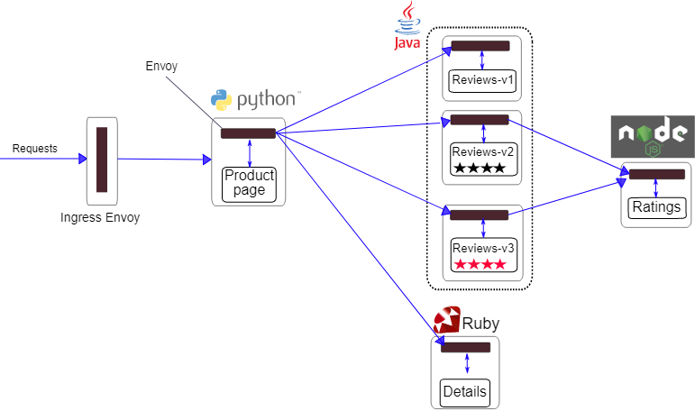

### 流量管理

流量管理包含很多部分，比如：

1. 路由请求控制，也就是可以通过指定某些参数，指定路由到某个容器中，当然也就可以控制流入到某些版本中
2. 故障注入控制，比如可以给某个请求添加故障，如，延时，或者直接报错等等
3. 流量转移，也就是将流量从微服务的一个版本逐步迁移到另一个版本
4. 熔断机制，当某个容器接受了大量的请求，为了防止爆炸，可以进行熔断。
5. 超时重试机制，比如虽然下游只请求了一次，但是流量管理器对具体的某个容器发送请求后没有得到数据，他不会立即返回失败，它会再多试几次

案例还是使用的第一节的bookinfo的案例，bookinfo的架构如下：


* 1.请求通过ingress的envoy 发送给product page（python的api）
* 2.product page会请求2个接口，一个reviews接口（java的api，有多个版本），一个是details接口（ruby的api）
* 3.上一步的reviews接口的某些版本还会去查询ratings接口（node的api）

### 第一部分，讲讲路由控制

#### 1.1 简单介绍

其实流量的管理都是建立在某些资源上的，这里就涉及到istio中的一些独立的资源:

1. 虚拟服务
2. 目标规则
3. 网关
4. 服务入口
5. sidecar

##### 1.1.1 虚拟服务
虚拟服务让您配置如何在服务网格内将请求路由到服务。每个虚拟服务包含一组路由规则，Istio `按顺序`评估它们，
Istio 将每个给定的请求匹配到虚拟服务指定的实际目标地址

```yaml
#版本
apiVersion: networking.istio.io/v1alpha3
#资源类型
kind: VirtualService
metadata:
  #具体该资源的名字，由于并没有指定ns，因此ns就是default
  name: reviews
spec:
  # hosts 字段列举虚拟服务的主机。未来可能会被路由规则通过host=?指定
  hosts:
    - reviews
  http:
    # 匹配条件（优先），只允许请求头中携带end-user: jason的请求才能匹配，流量流入到host name为reviews，版本为v2的目标中（pod）
    - match:
        - headers:
            end-user:
              exact: jason
      route:
        - destination:
            host: reviews
            subset: v2
    # 匹配路由（次优先），如果上面的匹配条件没匹配到，那么所有流量都会流到这里，而这里会流入v3版本
    - route:
        - destination:
            host: reviews
            subset: v3
```

如上所示，我们的一个虚拟服务的例子。 查询如下：
```
[root@centos01 istio-1.12.3]# kubectl get vs
NAME       GATEWAYS               HOSTS         AGE
reviews                           ["reviews"]   3d22h
```

##### 1.1.2 目标规则
将虚拟服务可以视为将流量如何路由到给定目标地址，而目标规则则是来配置该目标的流量，在评估虚拟服务路由规则之后，目标规则将应用于流量的“真实”目标地址。

正是因为有了目标规则，因此我们可以通过配置规则，将流量进行指定发送，也就是`负载均衡`。


默认情况下，Istio 使用轮询的负载均衡策略，实例池中的每个实例依次获取请求。
Istio 同时支持如下的负载均衡模型，可以在 DestinationRule 中为流向某个特定服务或服务子集的流量指定这些模型。

* 随机：请求以随机的方式转到池中的实例。
* 权重：请求根据指定的百分比转到实例。
* 最少请求：请求被转到最少被访问的实例。

```yaml
apiVersion: networking.istio.io/v1alpha3
kind: DestinationRule
metadata:
  name: my-destination-rule
spec:
  host: my-svc
  # 随机策略选择随机
  trafficPolicy:
    loadBalancer:
      simple: RANDOM
  subsets:
  # 会随机到3个版本上，这些标签应用于 Kubernetes 服务的 Deployment 并作为 metadata来识别版本
  - name: v1
    labels:
      version: v1
  - name: v2
    labels:
      version: v2
    trafficPolicy:
      loadBalancer:
        simple: ROUND_ROBIN
  - name: v3
    labels:
      version: v3
```

##### 1.1.3 网关
这个名词不需要解释了，就是gateway。用来控制某个东西（网络流量）的进出许可

Istio 提供了一些预先配置好的网关代理部署：
1. istio-ingressgateway（进入流量许可，允许外部的接口访问）
2. istio-egressgateway（出口流量许可，允许内部访问指定的外部接口）

实例：
```yaml
apiVersion: networking.istio.io/v1alpha3
kind: Gateway
metadata:
  name: ext-host-gwy
spec:
  selector:
    app: my-gateway-controller
  servers:
  - port:
      number: 443
      name: https
      protocol: HTTPS
    hosts:
    - ext-host.example.com
    tls:
      mode: SIMPLE
      serverCertificate: /tmp/tls.crt
      privateKey: /tmp/tls.key

```
这个网关配置让 HTTPS 流量从 ext-host.example.com 通过 443 端口流入网格，但没有为请求指定任何路由规则。
为想要工作的网关指定路由，您必须把网关绑定到虚拟服务上。正如下面的示例所示，使用虚拟服务的 gateways 字段进行设置
```yaml
apiVersion: networking.istio.io/v1alpha3
kind: VirtualService
metadata:
  name: virtual-svc
spec:
  hosts:
  - ext-host.example.com
  gateways:
    - ext-host-gwy
```

##### 1.1.4 服务入口(目前用不着)
使用服务入口（Service Entry） 来添加一个入口到 Istio 内部维护的服务注册中心。
添加了服务入口后，Envoy 代理可以向服务发送流量，就好像它是网格内部的服务一样。配置服务入口允许您管理运行在网格外的服务的流量，它包括以下几种能力：

* 为外部目标 redirect 和转发请求，例如来自 web 端的 API 调用，或者流向遗留老系统的服务。
* 为外部目标定义重试、超时和故障注入策略。
* 添加一个运行在虚拟机的服务来扩展您的网格。

您不需要为网格服务要使用的每个外部服务都添加服务入口。默认情况下，Istio 配置 Envoy 代理将请求传递给未知服务。
但是，您不能使用 Istio 的特性来控制没有在网格中注册的目标流量。

##### 1.1.5 Sidecar(目前用不着)

略


#### 1.2 故障注入
没啥大用，就是闲着蛋疼感觉和阿里搞的那个混沌工程有关，纯属吃饱了没事干，略


#### 1.3 流量转移

流量转移就是在虚拟服务中，配置的匹配路由中，指定权重然后进行流量的切换。
`samples/bookinfo/networking/virtual-service-reviews-50-v3.yaml`

```yaml
apiVersion: networking.istio.io/v1beta1
kind: VirtualService
...
spec:
  hosts:
    - reviews
  http:
    - route:
        - destination:
            host: reviews
            # 这里的subset就是通过再destination role中定义的，因此是由vs流向指定的服务，由dr流入到具体的版本
            subset: v1
          weight: 50
        - destination:
            host: reviews
            subset: v3
          weight: 50
``` 

其实k8s自带了流量的切换，但那个流量的切换是通过增加某个版本的实例，从而在轮巡中获取更多的请求次数。
而istio是通过流量分发给对应版本，实际上是不涉及容器的扩容和缩容的


